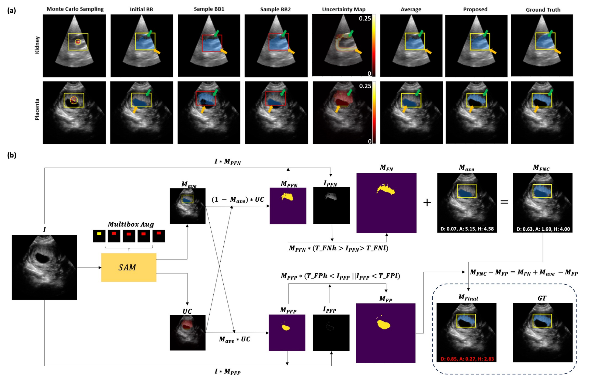
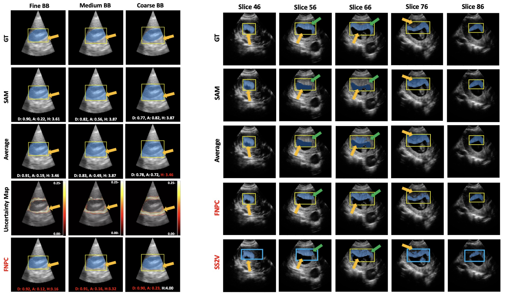
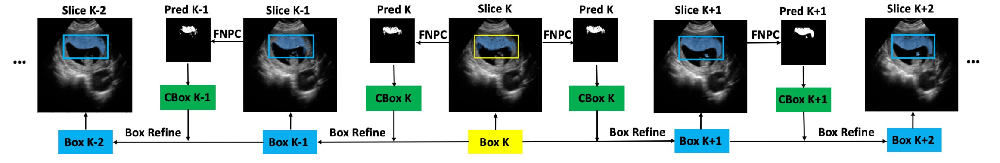

# FNPC-SAM
[](https://arxiv.org/abs/2308.10382)

The official implementation for paper: False Negative/Positive Control for SAM on Noisy Medical Images. **FNPC-SAM** is a training-free, uncertainty-guided False Negative/Positive Control method developed to improve the Segment Anything Model (SAM) on noisy medical images, specifically targeting low-contrast, challenging data like ultrasound. We further propose Single Slice to Volume (**SS2V**) that extends the **FNPC-SAM** from 2D to 3D data, realizing 3D segmentation with single-slice bounding box prompt input.



## Installation
This project depends on the official Segment Anything Model (SAM) codebase and checkpoints.

1. Clone this repository:

```bash
git clone <your_fork_or_repo_url>
cd FNPC
```

2. Set up SAM **first** by following the official instructions:
- Official SAM repository: `https://github.com/facebookresearch/segment-anything`
- You must complete SAM environment setup (including PyTorch/CUDA compatibility) before running FNPC-SAM.

3. Place SAM checkpoints under `weights/` (expected by the scripts), for example:
- `weights/sam_vit_l_0b3195.pth`
- `weights/sam_vit_h_4b8939.pth`

4. Install additional dependencies used by this project:

```bash
pip install -r requirements.txt
```

### Suggested `requirements.txt`
Based on repository imports and usage:

```txt
numpy
scipy
matplotlib
opencv-python
tqdm
Pillow
natsort
bridson
torch
torchvision
```

> Note: `segment_anything` is included in this repository, but its runtime dependencies should still follow the official SAM setup guide.

## Getting Started

Before running experiments, check the two entry scripts and set task-specific hyperparameters:
- `FNPC_Interface.py`
- `Single_Slice_to_Volume.py`

Both scripts currently contain placeholder values (e.g., `M`, `N`, `ave_thre`, `uncertain_thre`, `fna/fnb/fpa/fpb`) that must be filled before execution.

### Main Entry Points

#### 1) FNPC Interface (2D Ultrasound)



File: `FNPC_Interface.py`

- Runs SAM-based segmentation on each 2D ultrasound frame.
- Uses a rough annotation (bounding-box-like mask) as prompt.
- Performs FNPC (False Negative / False Positive Correction):  
  it estimates uncertainty from multiple augmented box prompts, then updates predicted masks by recovering likely missed regions (FN correction) and suppressing likely over-segmented regions (FP correction).

#### 2) 3D Segmentation / Correction



File: `Single_Slice_to_Volume.py`

- Extends the 2D FNPC process to slice-wise 3D volume segmentation.
- Starts from an initial reference slice annotation, then propagates correction across neighboring slices.
- Builds per-slice corrected masks that can be stacked as a volume.

## Input Data Organization

### Recommended structure for 2D FNPC (`FNPC_Interface.py`)

```text
<DATA_ROOT>/
├── Images/
│   ├── <subject_id_1>/
│   │   ├── 000.png
│   │   ├── 001.png
│   │   └── ...
│   └── <subject_id_2>/
├── Annotations_heavy_rough/
│   ├── <subject_id_1>/
│   │   ├── 000.png
│   │   ├── 001.png
│   │   └── ...
│   └── <subject_id_2>/
└── GTs/
    ├── <subject_id_1>/
    │   ├── 000.png
    │   ├── 001.png
    │   └── ...
    └── <subject_id_2>/
```

### Recommended structure for 3D slice-to-volume (`Single_Slice_to_Volume.py`)

```text
<DATA_ROOT_3D>/
├── Images_Subjectx/
│   ├── <volume_id_1>/
│   │   ├── slice_000.png
│   │   ├── slice_001.png
│   │   └── ...
│   └── <volume_id_2>/
├── Annotations_0002/
│   ├── <volume_id_1>/
│   │   └── slice_59.png
│   └── <volume_id_2>/
└── GTs/
    ├── <volume_id_1>/
    │   ├── slice_000.png
    │   ├── slice_001.png
    │   └── ...
    └── <volume_id_2>/
```

### Naming and format assumptions
- File format: `.png` (the scripts read PNG paths explicitly).
- Per-subject/per-volume folder names must match across images, rough annotations, and GT folders.
- 3D script uses natural sorting (`natsort`) for slice filenames; keep consistent numeric naming (`slice_0.png`, `slice_1.png`, ... or zero-padded style).
- In the current 3D script, processing range is hardcoded (`start_num=59`, `end_num=94`), so your sorted slice list must include these indices.

## Running the Code

### 1) Run FNPC on 2D images

```bash
python FNPC_Interface.py \
  --data /path/to/FNPC_dataset \
  --outdir experiment_2d \
  --sam_type vit_l
```

Expected input subfolders under `--data`:
- `Images/`
- `Annotations_heavy_rough/`
- `GTs/`

Outputs will be written to:
- `./outputs/<outdir>/<subject_id>/`

### 2) Run 3D slice-to-volume processing

```bash
python Single_Slice_to_Volume.py \
  --data /path/to/Reconstruction \
  --outdir experiment_3d \
  --sam_type vit_l
```

Expected input subfolders under `--data`:
- `Images_Subjectx/`
- `Annotations_0002/`
- `GTs/`

Outputs will be written to:
- `./outputs/<outdir>/<volume_id>/`

## Notes

- Ensure SAM checkpoints exist in `weights/` before running.
- Verify placeholder hyperparameters in both entry scripts are set for your dataset.
- If your image size differs from the default assumptions (many helper functions assume 128x128), update related preprocessing and mask-creation logic accordingly.


## Citation

If you use our ideas/code in your research, please use the following BibTeX entry.

```
@inproceedings{yao2024fnpc,
  title={FNPC-SAM: uncertainty-guided false negative/positive control for SAM on noisy medical images},
  author={Yao, Xing and Liu, Han and Hu, Dewei and Lu, Daiwei and Lou, Ange and Li, Hao and Deng, Ruining and Arenas, Gabriel and Oguz, Baris and Schwartz, Nadav and Oguz, Ipek},
  booktitle={Medical Imaging 2024: Image Processing},
  volume={12926},
  pages={1292602},
  year={2024},
  organization={SPIE}
}
```
